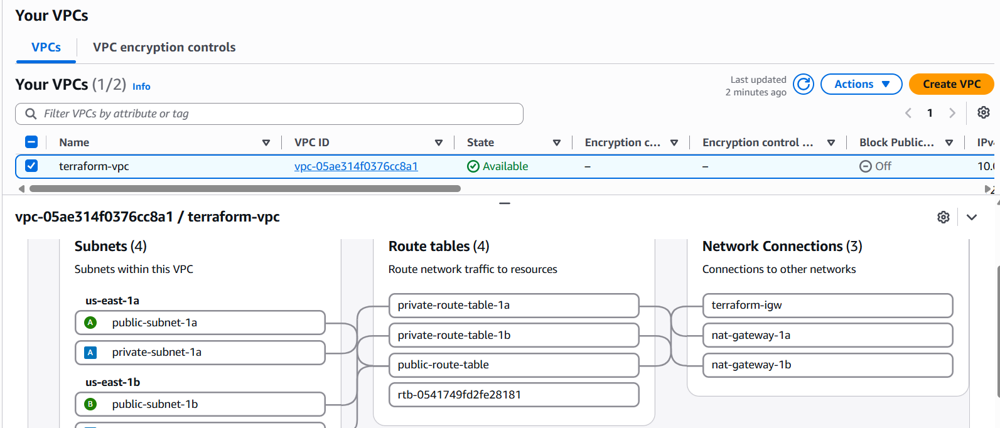
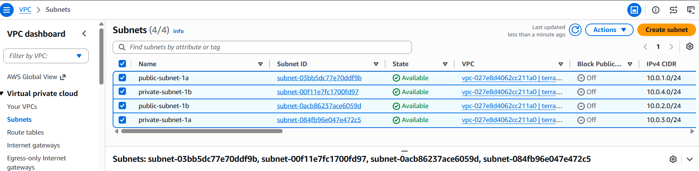
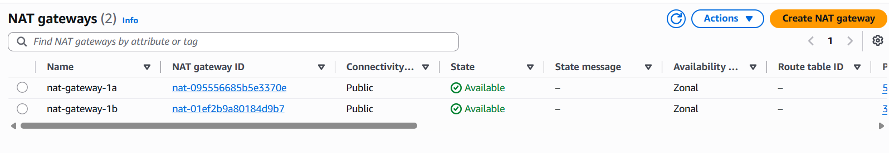
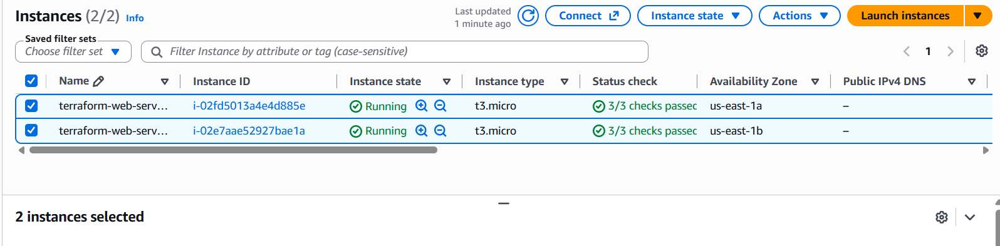

# Terraform AWS VPC Infrastructure

Infrastructure-as-Code project that provisions a multi-AZ AWS environment using Terraform.

## Project Overview

This project demonstrates how to build and manage AWS infrastructure using Terraform instead of manually creating resources through the AWS Console.

The infrastructure includes:

* AWS VPC
* Public and private subnets across two Availability Zones
* Internet Gateway
* NAT Gateways
* Public and private route tables
* Route table associations
* EC2 security group
* Two private EC2 instances
* Terraform outputs and state management


## Infrastructure Screenshots

The following screenshots demonstrate the AWS infrastructure provisioned and managed using Terraform.

### 1. VPC and Network Architecture



### 2. Multi-AZ Subnets



### 3. NAT Gateways



### 4. EC2 Instances




## Architecture

```text
                    Internet
                       │
                Internet Gateway
                 /             \
          Public Subnet 1a   Public Subnet 1b
             │                  │
          NAT GW 1            NAT GW 2
             │                  │
       Private Subnet 1a   Private Subnet 1b
             │                  │
          EC2 Server 1      EC2 Server 2
```

## Technologies

* Terraform
* AWS
* Amazon VPC
* Amazon EC2
* NAT Gateway
* Internet Gateway
* Linux
* Git
* GitHub

## Key Terraform Concepts Practised

* Infrastructure as Code
* Terraform resources and data sources
* Variables and outputs
* Resource dependencies
* Terraform state
* Terraform plan and apply
* AWS networking
* Multi-AZ infrastructure
* Public vs private subnets

## Deployment

Initialize Terraform:

```bash
terraform init
```

Validate the configuration:

```bash
terraform validate
```

Review the infrastructure plan:

```bash
terraform plan
```

Deploy the infrastructure:

```bash
terraform apply
```

Destroy the infrastructure when it is no longer needed:

```bash
terraform destroy
```

## Project Evidence

Screenshots and supporting documentation are stored in the `docs` directory.

## Learning Outcome

This project strengthened my understanding of Infrastructure as Code and AWS networking by building a multi-AZ environment programmatically with Terraform.
